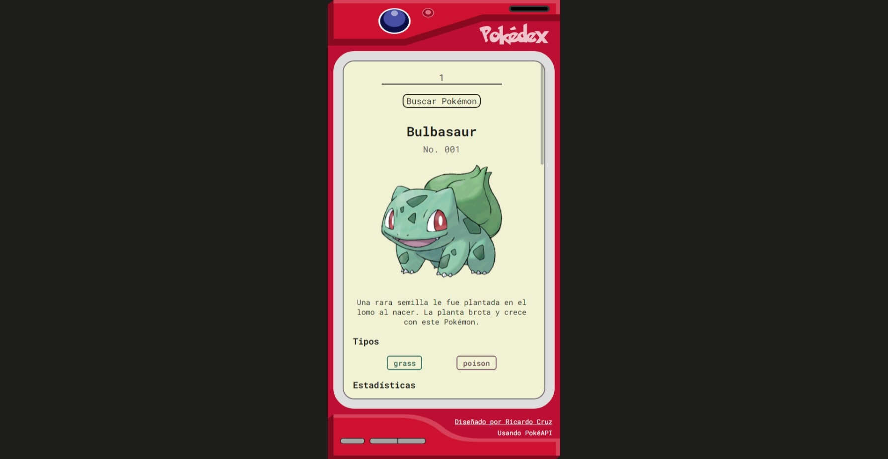

# Pokédex Web

## A webpage that consults PokéAPI to show Pokemon data

[Available Here/Disponible Aquí](https://ricardojcruz.github.io/pokedex-web/)

Looking for a simple way to get the info of your favorite Pokémon?

This webpage is designed as a Pokédex, search your favorite Pokémon by name or id.

Your search gets the data from PokéAPI to show you:
  - Name and ID
  - Sprite
  - Description
  - Types
  - Stats
  - Movements

(Only available in Spanish for the moment)

## Details

**Search**

Type the name or the ID of the Pokémon you want to search, e.g. "pikachu" or "25". The form handles weird capitalization like ("dItTO").

If you type a wrong name or id you shall get a message error. Try again!

**Pokémon Info**

Your search will return neatly formatted data of the Pokémon you looked up.

*Notice*: Although each one of the moves seem to be links that redirect somewhere they have actually no functionality built into them yet.

### Thanks to

The [Launch X](https://github.com/LaunchX-InnovaccionVirtual) team for the training and enthusiasm given

The [PokéAPI](https://pokeapi.co/) team for the development of their awesome tool

[manuelbasanta](https://github.com/accesibleprogramacion/pokedex) for the tutorial that gave a great headstart to this project

--------------------------------------

## Una página web que consulta PokéAPI para mostrar datos de Pokemón 

¿Buscas una forma sencilla de encontrar información sobre tu Pokémon favorito?

Esta página web está diseñada como una Pokédex, busca a tu Pokémon favorito por nombre o id.

Tu busqueda recibe los datos de PokéAPI para mostrarte:
  - Nombre e ID
  - Imagen
  - Descripción
  - Tipos
  - Estadísticas
  - Movimientos
